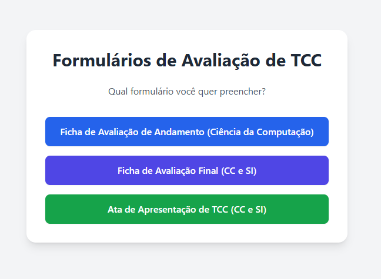

# Projeto extra: Formulários de avaliação e ata de TCC

Acesso: https://elc1090.github.io/extra-2025a-zerowin1/

### Desenvolvedor(a)
Thales de Vargas Stamm - Sistemas de Informação

### Produto

O objetivo deste projeto foi criar um conjunto de formulários web responsivos para digitalizar e otimizar o processo de avaliação de TCCs dos cursos de Ciência da Computação e Sistemas de Informação. A aplicação busca apresentar outra versão, adaptada com base nos  desenvolvimento e funcionalidades das soluções anteriores.

As principais funcionalidades desenvolvidas são:

Três Formulários Distintos:

Avaliação de Andamento (apenas para Ciência da Computação).

Avaliação Final (unificada para Ciência da Computação e Sistemas de Informação).

Ata de Apresentação de TCC (ambos os cursos).

Validação de Dados: Há uma validação básica para o preenchimento de dados, como por exemplo a nota máxima por critério, utilização de apenas letras para o nome do aluno/professor...

Assinatura Digital: Além do método do canva foi implementada uma solução para fazer o upload de um arquivo contendo a assinatura.

Geração de PDF: Ao final do preenchimento, é possível gerar um arquivo PDF do formulário, com todos os dados e assinaturas. Não foi utilizado o modelo para geração de PDF(que estava no trabalho anterior), o PDF foi gerado "todo em código".

Geração de Link Compartilhável: Funcionalidade que cria um link com os dados do cabeçalho já preenchidos.

### Desenvolvimento

 A inspiração veio dos projetos anteriores, só utilizei algumas tecnologias mais modernas, ajustei alguns componentes que na minha visão deixavam a tela mais limpa e o código mais simples de manter (apesar de ter feito apenas uma análise rápida, visto que não era um dos requisitos inclusos no "pacote 2").

Para a interface, optei por usar React, mas de uma forma simplificada, fazendo o carregamento via CDN. Isso permitiu criar componentes reutilizáveis (como os campos de input e a área de assinatura) e gerenciar o estado dos formulários (os dados e as notas) de maneira eficiente. 

A estilização foi feita com Tailwind CSS, também via CDN. Desse modo pude estilizar os componentes direto no HTML.

Pra geração de pdfs utilizei a biblioteca jsPDF. 

O processo foi iterativo: comecei com um formulário básico, adicionei as validações de dados (campos obrigatórios, formato pra data/hora, etc.), corrigi bugs (diversos, por exemplo, por algum motivo o canvas estava desenhando em uma posição diferente do cursor) e,  depois de ter a base pronta, fui reutilizando para os outros forms, adaptando quando necessário.

#### Tecnologias

HTML5: estrutura base

Tailwind: estilização

JavaScript: Linguagem principal para toda a lógica da aplicação.

React.js (via CDN): componentes e responsividade interface

Babel (via CDN):  permite usar a sintaxe JSX do React diretamente no navegador.

jsPDF: Biblioteca para a geração de documentos PDF no lado do cliente

#### Ambiente de desenvolvimento

Editor de Código: Visual Studio Code.

Controle de Versão e Deploy: Git e GitHub, com o deploy feito através do GitHub Pages.

#### Referências e créditos

Projetos de Referência: O projeto foi fortemente inspirado nos trabalhos anteriores, apenas adaptado.

Gemini (Google AI): Utilizado para modificação (e sugestões de modificação) da interface, depurar problemas (como falha na geração do PDF), refatoração de código...

A ideia de usar tudo via CDN e de utilizar o Babel foi dele também. Porque minha ideia inicial seria fazer tudo em HTML, CSS e JS puros pro projeto ficar mais "simples". Eventuais dúvidas sobre utilização dos canvas, useState e até alguns ajustes pra validação dos campos foram feitos também com auxilio da IA.

---
Projeto entregue para a disciplina de [Desenvolvimento de Software para a Web](http://github.com/andreainfufsm/elc1090-2025a) em 2025a
